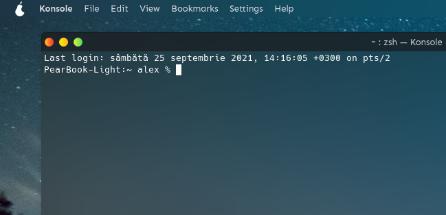

# This is the default pearOS NiceC0re aurorae theme.


It features two versions:
- dark (forked from Sweet Mars aurorae theme)
- light (originally made in some SVG editor)

# Installation

This aurorae theme features an install script
- git clone this repo
- Do in terminal:
 ```sh
 cd pearOS-Default-Aurorae
./install.sh
```
- enjoy

# Compatibility

KDE Desktop Environment >=5.20

# Copyright

Dark version is a direct clone from Sweet Mars aurorae(window decorations)

Light Versions is original, designed in a SVG editor and incorporated with the Dark version

Install script is originally made in GNU Nano editor.

(c) 2021 Under the GNU Public License V3 or newer
